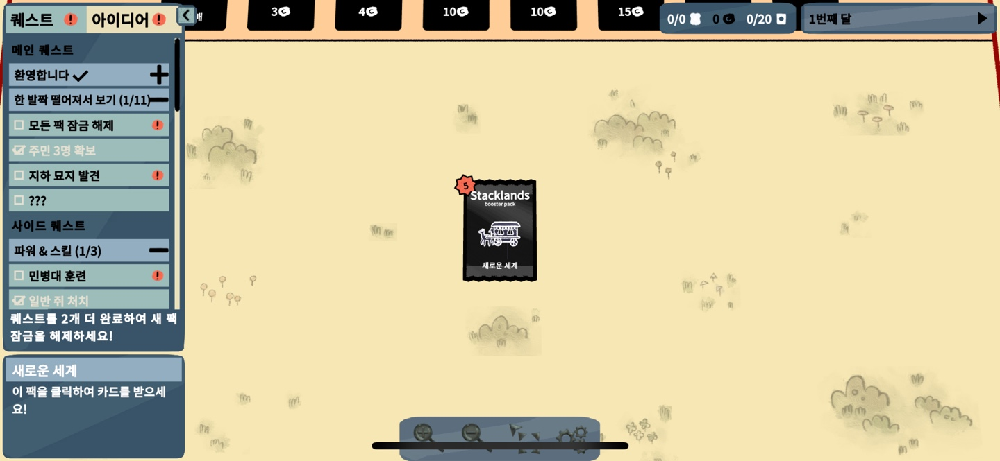
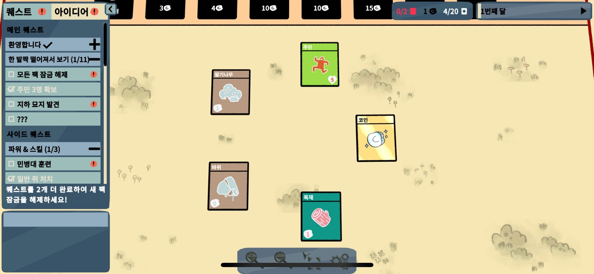
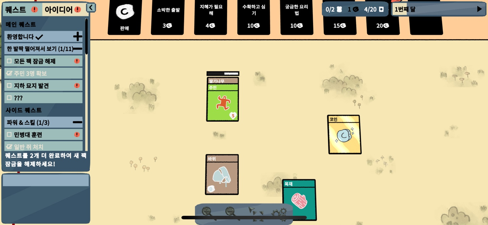
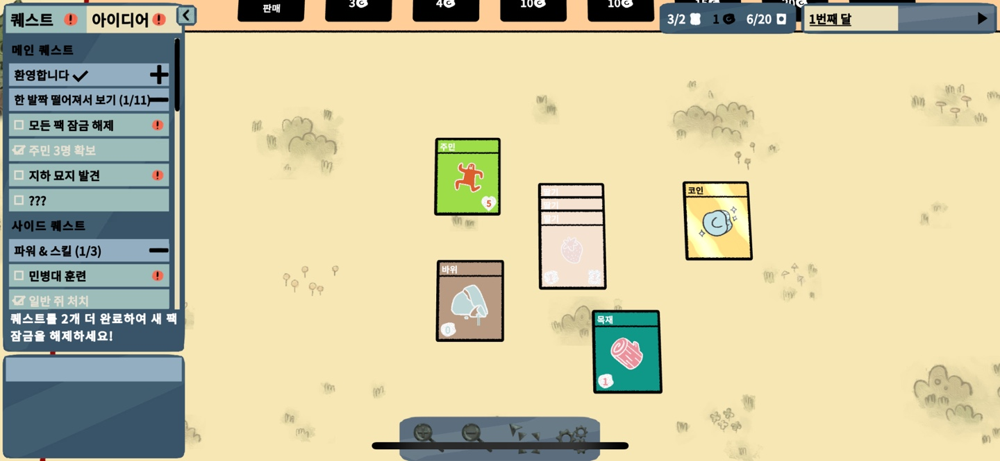
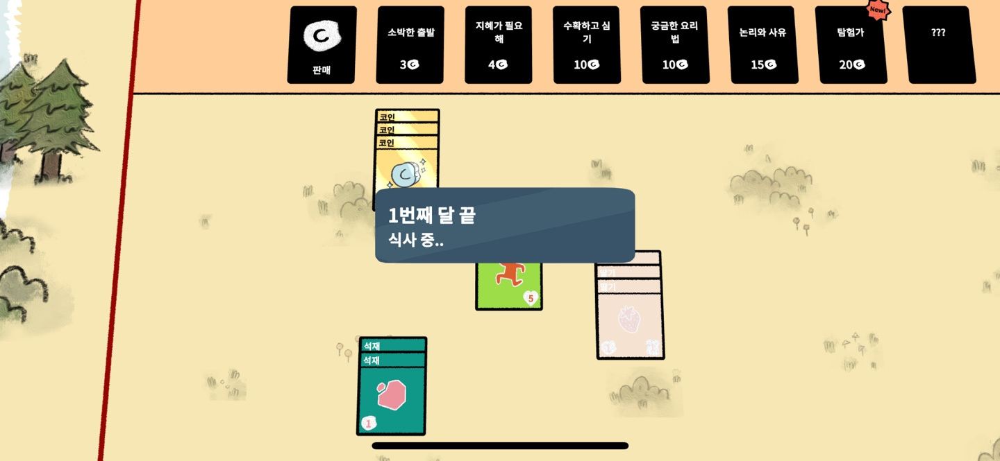
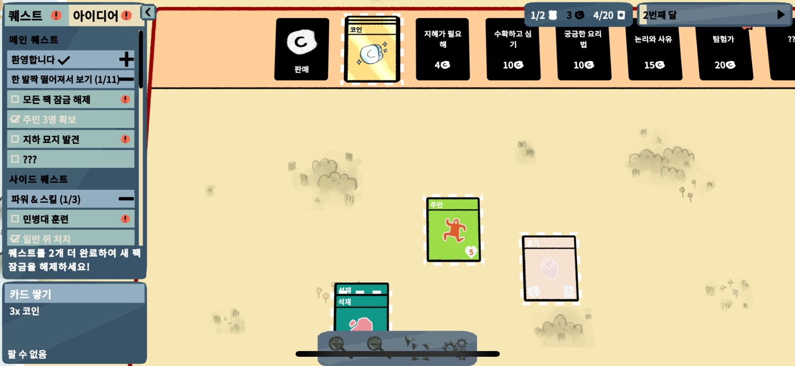
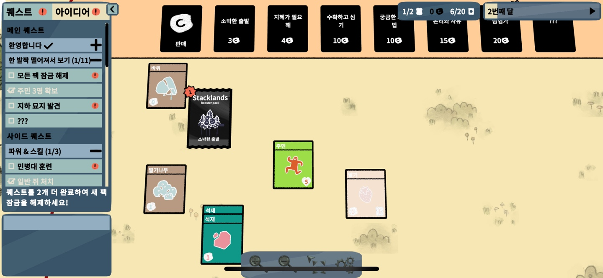
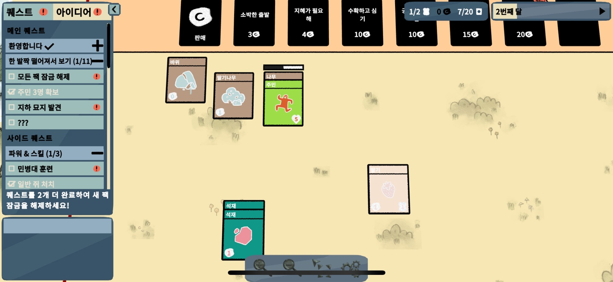

# 스마트폰게임프로그래밍 텀프로젝트
## 프로젝트 제목: Stacklands 모작
1. 게임 컨셉
	- 건설 시뮬레이션 게임
	- 게임의 모든 요소는 카드 형태로 되어 있다.
	- 일꾼을 배치하여 식량을 채집하고 건물을 지을 수 있다.
	- 모든 일꾼이 죽으면 게임이 끝난다.
2. 개발 범위
	- 턴
		- 2분이 지나면 턴이 끝난다.
		- 턴이 끝나면 일꾼카드 1장 당 식량 카드 2장 소비
	- 카드
		- 일꾼 카드, 몬스터 카드를 제외한 모든 카드는 기본적으로 가격이 있음. 
		- 생물 카드
			- 생물 카드는 기본적으로 생명력을 가지고 있다.
			- 일꾼 카드
				- 턴이 끝날 때 성인 일꾼은 식량카드 2장, 아기 일꾼은 식량카드 1장 소비.
				- 기본 체력은 15임.
				- 장비에 따라 공격력, 체력, 방어력 달라진다.
			- 몬스터 카드
				- 자신을 기준으로 가장 가까운 일꾼 카드를 찾아서 이동한다.
				- 몬스터의 종류에 따라 체력이 다르다.
		- 무생물 카드
			- 무생물 카드는 기본적으로 가격이 있고, 팔아서 코인으로 교환이 가능하다.
			- 식량 카드
				- 식량카드의 종류 마다 배부름 수치가 다름. 
			- 건축물 카드
			- 재료 카드
	- 전투
		- 마을에서 주기적으로 몬스터가 등장함
		- 동굴에서의 전투 (기존의 게임과 다르게 구현할 예정)
3. 예상 게임 실행 흐름
	- 
	- 게임 시작 후 첫 화면이다. 카드팩에는 5장의 카드가 들어있다. 클릭하면 카드가 튀어나온다.
	
	- 처음 시작하는 카드는 일꾼카드, 딸기나무, 바위, 목재, 코인으로 고정되어있다.
	
	
	- 일꾼 카드를 딸기나무와 함께 배치시키고 일정 시간이 지나면 딸기카드 한장씩 나온다.
	
	- 시간이 지나면 1번째 달이 지나게 되고, 일꾼 1명당 2개 분량의 식량을 주어야 한다.
	
	- 코인 3개를 '소박한 출발' 카드팩을 구매하는 곳에 가져가면 카드팩이 나온다.
	
	- 카드팩을 하나씩 클릭하면 랜덤한 카드가 나온다. '소박한 출발' 카드팩은 자원 카드 3개를 뱉어낸다.
	
	- 그렇게 나온 자원 카드에 일꾼을 배치시키며 다른 종류의 자원을 얻고, 마을을 발전 시키는 게임이다.
4. 개발 일정
	- 1주
		- 일꾼, 식량, 건축물 class 생성
		- 카드별 기본 기능 구현
	- 2주
		- 카드의 조합, 소요 시간 입력
	- 3주
		- 랜덤 카드팩 구현
	- 4주
		- 일꾼 착용 가능한 헬멧, 방어구, 무기 구현
	- 5주
		- 몬스터 class 생성
	- 6주
		- 동굴 뷰, 전투 시스템 구현
	- 7주
		- 게임 타이틀 뷰 제작
	- 8주
		- 사운드 적용
	- 9주
		- 테스트 