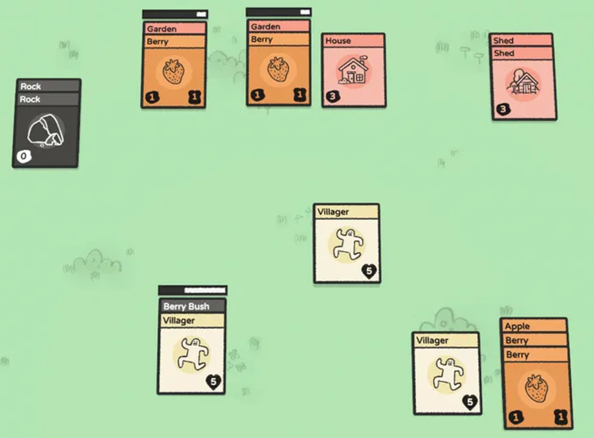
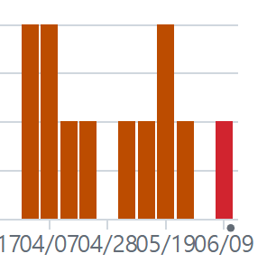

# 스마트폰게임프로그래밍 텀프로젝트
## 프로젝트 제목: Stacklands 모작
## Stacklands

- 카드 운영 게임
- 주민 카드와 자원 카드를 합쳐 놓으면 재료 카드가 생성됨.
- 카드를 팔고 돈을 모아서 마을을 운영하는 게임

# 개발 진척도

- 턴 (100%)
- 카드 (100%)
- 전투 (0%)
    - 전투하는 기능을 추가하지 않았음.

# 주차별 커밋 횟수

| 주차 | 날짜 | Commit 수 |
| --- | --- | --- |
| 1week | 4/1 - 4/7 | 4 |
| 2week | 4/8 - 4/14 | 4 |
| 3week | 4/15 - 4/21 | 2 |
| 4week | 4/22 - 4/28 | 2 |
| 5week | 4/29 - 5/5 | 0 |
| 6week | 5/6 - 5/12 | 2 |
| 7week | 5/13 - 5/19 | 4 |
| 8week | 5/20 - 5/26 | 2 |
| 9week | 5/27 - 6/2 | 0 |
| 10week | 6/3 - 6/9 | 2 |
| 11week | 6/10 - 6/13 | 3 |

# 사용 기술

1. Singleton
    1. 수업 내용에서 차용
    2. Card Generator를 Singleton으로 구현함.
    3. 언제든 문자열을 전달하여 원하는 Card 객체를 새롭게 할당받을 수 있게 하였음.
2. Supplier
    1. 직접 공부해서 가져옴
    2. 복잡한 객체 생성 논리를 캡슐화 (함수형 프로그래밍)
    3. Card Generator에서 특정 문자열을 전달했을 때 항상 일정한 조건의 새로운 객체가 할당되기 위함.
3. Timer
    1. 직접 개발
    2. 일정 시간이 지나면 턴이 끝남.
    3. 턴이 끝났을 때 게임오버 판정을 함.

# 아쉬운 점

1. 에뮬레이터가 너무 느리고 성능이 안 좋아서 디버깅에 어려움이 있었다. 안드로이드 휴대폰이 없어서 개발 속도가 느려졌다.
2. 전투 시스템을 구현하지 못한 것이 아쉽다. 
3. 앱스토어에 팔게된다면
    1. 카드가 겹치지 않도록 배치
    2. 카드의 이동을 부드럽게 구현

# 수업에 대한 내용

1. 깃허브가 직렬로 된 정보여서 정리가 잘 되지 않는 느낌이었다.
2. 한 프로젝트가 끝날 때 코드의 전체적인 구조나 주목할만한 기술이 그림으로 묘사된다면 좋을 것 같다.