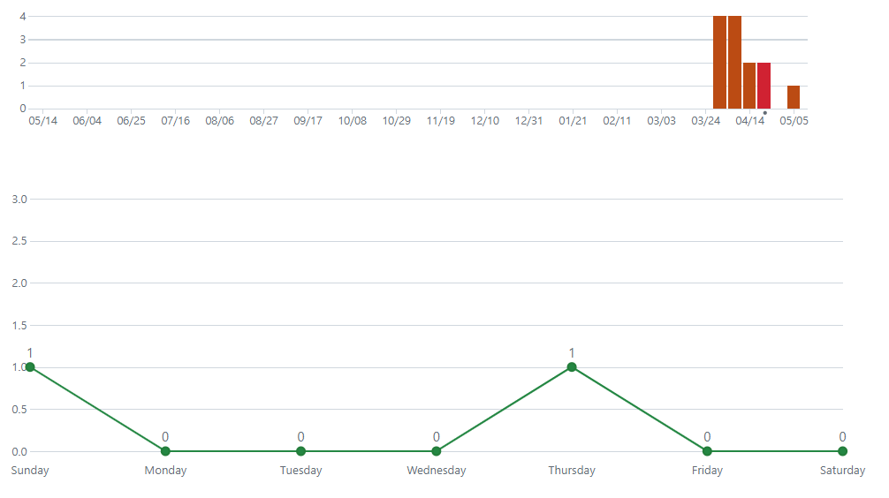
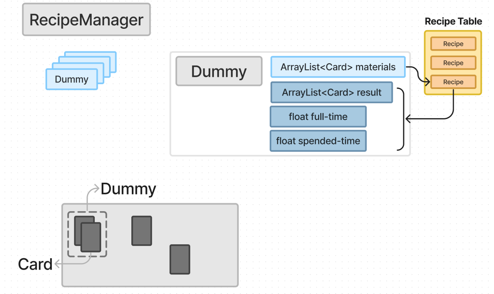

# 스마트폰게임프로그래밍 텀프로젝트
## 프로젝트 제목: Stacklands 모작
## Stacklands

- 카드 운영 게임

## 진행 상황

1. 개발 범위
    - 턴 (0%)
        - 턴 개념은 구현하지 않음.
    - 카드 (80%)
        - 카드의 종류, 조합, 마우스 처리 등, 기술적인 부분은 모두 구현함.
        - 컨텐츠 추가를 아직 하지 않았음.
    - 전투 (0%)
        - 전투하는 기능을 추가하지 않았음.

## Git Commit

| 주차 | 날짜 | Commit 수 |
| --- | --- | --- |
| 1week | 4/1 - 4/7 | 4 |
| 2week | 4/8 - 4/14 | 4 |
| 3week | 4/15 - 4/21 | 2 |
| 4week | 4/22 - 4/28 | 2 |
| 5week | 4/29 - 5/5 | 0 |
| 6week | 5/6 - 5/9 | 1 |

## 코드 구조 설명

MainScene의 모습이다.

1. Card
    1. 카드의 비트맵, 이름, 생명 등과 같은 정보를 담고 있음.
    2. 카드의 색깔에 맞춰 자식객체로 생성한다. YellowCard, OrangeCard, BlackCard 등…
    
	
    
2. CardManager
    1. MainScene에 있는 모든 Card를 관리함.
    2. 모든 Card의 클릭, 충돌처리를 검사함.
    
	
    
	
    
	
    
	
    
3. Dummy
    1. 카드 더미와, 그 카드 더미가 만들 수 있는 새로운 카드 정보를 관리한다.
4. RecipeManager
    1. Scene에 있는 Dummy 객체들을 관리한다.
    2. 카드 더미들의 목록으로 새로운 아이템을 만들 수 있는지 검사한다.
    3. 만들 수 있으면 결과물, 소요 시간이 Dummy 객체 안에 쓰여진다.
    
	
    

5. Recipe

	1. 아이템 레시피를 저장해둔다.

	

6. CardGenerator

	1. Singleton 객체이다.
	2. 고정적인 카드 정보를 저장해둔다.
	3. String 정보로 새로운 카드 객체를 생성해서 반환해주는 함수를 갖고 있다.

	

7. BoosterPackGenerator

	1. Singleton 객체이다.
	2. 고정적인 부스터팩 카드 정보를 저장해준다.
	3. String 정보로 새로운 부스터팩을 생성해서 반환해준다.
	4. 부스터팩 안에는 정해진 확률에 따라 여러장의 카드가 생성되어 반환된다.

	

8. 전체 구조

	

## 구현하면서 어려웠던 부분

: 여러개의 아이템을 효율적으로 관리하는 방법에 대해서 고민을 많이 했다. 고정적인 아이템 정보에 대해서 xml로 관리하는 방법을 알려주셨으면 좋겠다.